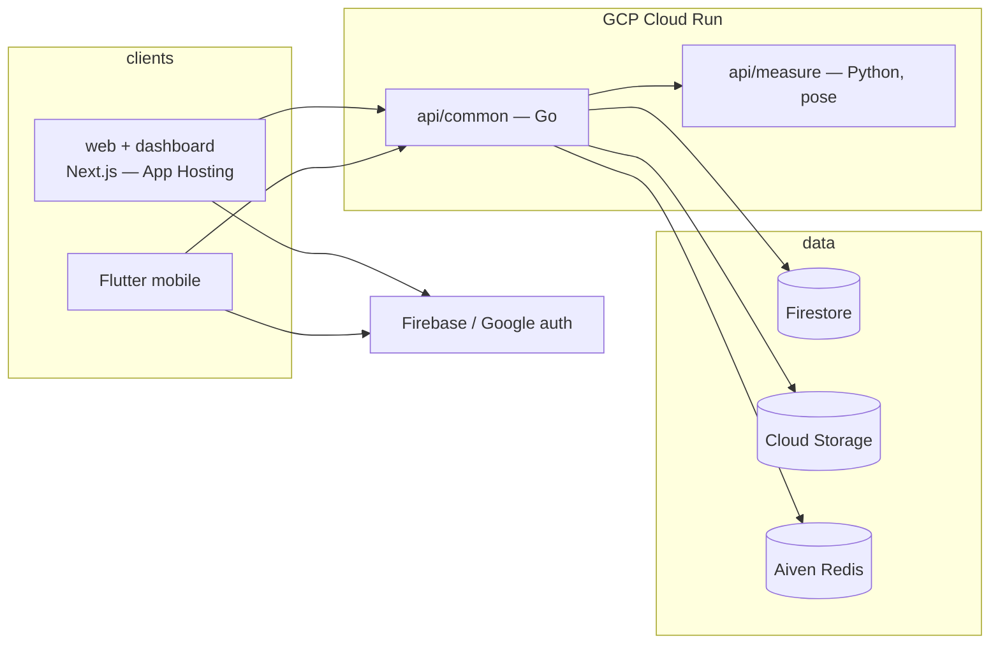

# Apparule

Fashion body-measurement platform — capture body measurements from a phone and
turn them into sizing data for a better-fitting shopping experience.

[](./LICENSE)
[](https://github.com/cuesoftinc/apparule/actions/workflows/build-and-test.yml)

## Overview

Apparule is a monorepo containing the clients, backend services, deployment
configuration, and documentation for the platform. A Go service owns
authentication and the core API, a Python service turns phone camera input into
body measurements, and a Next.js frontend serves the marketing site and user
dashboard. For a deeper description of the components and how they fit together,
see [docs/overview.md](docs/overview.md).

## Architecture



### Tech stack

| Layer          | Technology                                          |
| -------------- | --------------------------------------------------- |
| Backend API    | Go 1.26, Gin (`api/common`)                         |
| Measurement    | Python, FastAPI, MediaPipe, OpenCV (`api/measure`)  |
| Web            | Next.js, React, TypeScript                          |
| Mobile         | Flutter (primary), native Android/iOS               |
| Auth & data    | Firebase Google-only auth; Firestore (system of record, X-5) & Cloud Storage; shared Aiven Redis |
| Infrastructure | Docker, Helm, Terraform, GCP Cloud Run              |

## Repository structure

```
api/
  common/      Go service — authentication and core API
  measure/     Python service — MediaPipe pose-based body measurement
web/           Next.js marketing site + user dashboard
mobile/
  flutter/     Flutter app (primary mobile client)
  android/     Native Android (Kotlin)
  ios/         Native iOS (Swift)
deploy/
  docker/      Container/compose configuration
  helm/        Helm chart (deploys all services to Kubernetes)
  terraform/   Infrastructure as code
docs/          Project documentation
scripts/       Developer and CI helper scripts
```

Additional services follow the same convention: `api/common` is the shared Go
backend, and every other service lives under `api/<service-name>` named by its
function (never by its language).

## Getting started

### Prerequisites

- [Docker](https://www.docker.com/) & Docker Compose (recommended path)
- For native development: [Go](https://go.dev/) 1.26, [Node.js](https://nodejs.org/) 24,
  Python 3.12, and [Flutter](https://flutter.dev/)

### Quick start

```bash
cp .env.example .env
make up      # build + start api-common (:8080), api-measure (:8081), web (:3000)
make logs    # follow logs
make down    # stop
```

Configuration is provided at runtime via environment variables — for example
`FIREBASE_CONFIG_PATH`, the path to the Firebase service-account JSON used by
`api/common`. See [docs/setup.md](docs/setup.md) for details; `make help` lists
all targets. Never commit credentials or bake them into an image.

## Documentation
- [Hosted docs](https://cuesoft.gitbook.io/apparule) — the full documentation site (auto-synced from `docs/`)

- [Project overview](docs/overview.md) — architecture and components
- [Local setup](docs/setup.md) — development environment and per-service run commands

## Contributing

Contributions are welcome. Please read the [Contributing guide](CONTRIBUTING.md)
and our [Code of Conduct](CODE_OF_CONDUCT.md) before opening a PR.

## Security

Please report vulnerabilities privately — see our [Security policy](SECURITY.md).

## License

See [LICENSE](LICENSE).
