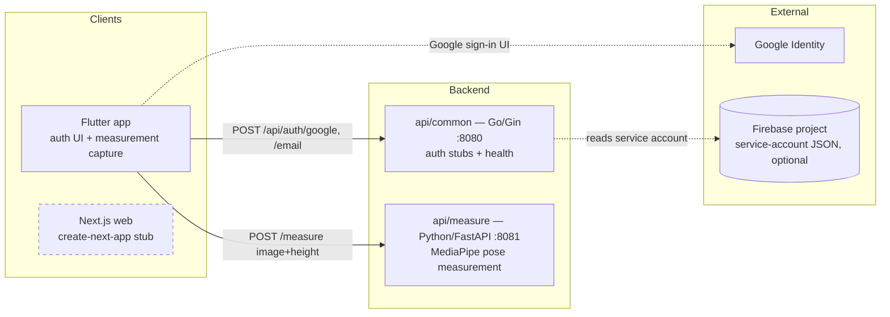
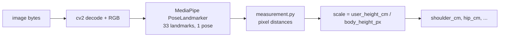
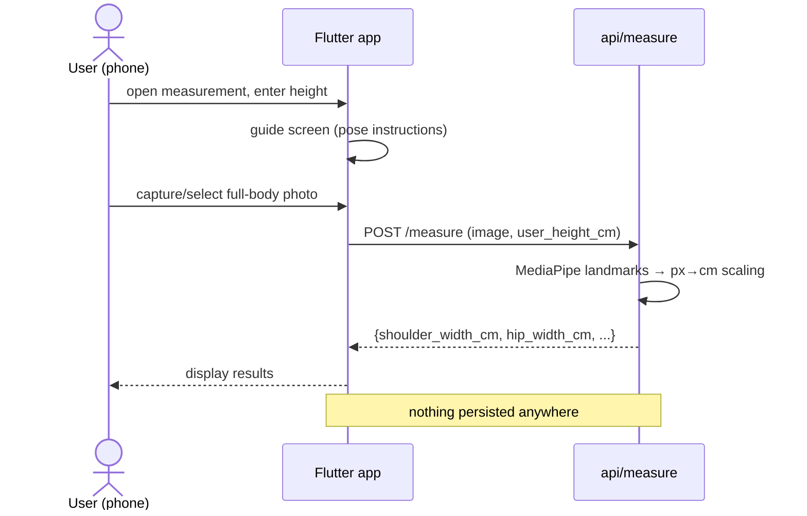
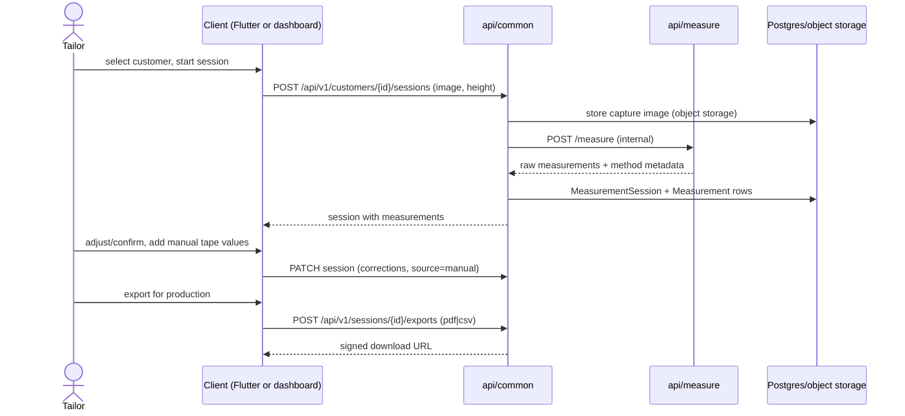
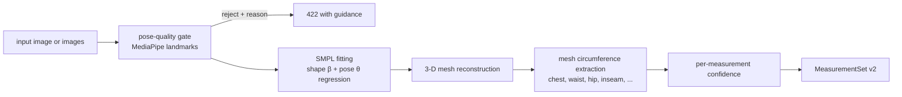

# Apparule — System Architecture

> Companion to [prd.md](prd.md). Describes the system as it **is** (verified
> against code) and as the PRD requires it to **become**. Markers: **[Current]**,
> **[PRD]**, **[Proposed]**.

## 1. Context — current state **[Current]**



Key facts the target design must reckon with:

- `POST /measure` is **stateless** — measurements are returned to the caller and
  stored nowhere server-side. The only persistence in the whole system today is
  the phone's `SharedPreferences` (name/email/phone + theme).
- Both auth endpoints are **stubs** (`internal/auth/auth.go`,
  `TODO(security-prd)`): Google login mints a JWT for the *service-account*
  email without verifying the incoming ID token; email login logs and returns.
- The web app is the unmodified create-next-app template.
- Firestore is initialised from `FIREBASE_CONFIG_PATH` but not used as a data
  store for any domain object.

## 2. Context — target state **[PRD + Proposed]**

```mermaid
flowchart LR
    subgraph Visitors & Users
        V[Visitor]
        T[Tailor / SME user]
    end

    subgraph apparule.cuesoft.io
        LAND[Landing + docs hub<br/>Next.js, public]
        DASH[Dashboard<br/>Next.js, authenticated]
    end

    subgraph Apparule backend
        AC[api/common — Go<br/>records, customers, consent,<br/>instance requests]
        AM[api/measure — Python<br/>measurement pipeline<br/>MediaPipe today → SMPL later]
        DB[(Postgres<br/>system of record)]
        OBJ[(Object storage<br/>capture images, exports)]
    end

    subgraph Cuesoft ecosystem — external
        ACC[account.cuesoft.io<br/>identity & session]
        UP[Upstat<br/>events & uptime]
        CL[clients.cuesoft.io<br/>support]
        PRIV[privacy.cuesoft.io<br/>privacy hub]
    end

    V --> LAND
    LAND -->|Demo Starts, GitHub Clicks| UP
    LAND -->|View on GitHub| GH[GitHub repo]
    LAND --> PRIV
    T --> DASH
    T -->|Flutter app| AC
    DASH -->|sign in| ACC
    DASH --> AC
    AC -->|verify session/token| ACC
    AC --> DB
    AC --> OBJ
    AC -->|internal call| AM
    DASH -.->|support| CL
```

Decisions embedded here (each ratifiable separately, see prd.md §8):

1. **api/common is the only writer** — web/mobile clients talk to api/common;
   api/common calls api/measure internally for pipeline runs. Today the Flutter
   app calls api/measure directly; that stays acceptable for self-hosted
   stateless use, but cloud record-keeping flows route through api/common.
   **[Proposed]**
2. **Postgres as system of record**, object storage for images. Firestore
   remains only if the account integration requires it. **[Proposed]**
3. **Auth delegation**: `account.cuesoft.io` owns identity **[PRD]**; api/common
   exchanges/validates its tokens and enforces per-workspace authorization
   locally (see §4.2).

## 3. Service breakdown

### 3.1 api/common (Go, Gin) — core API

| Package | Today **[Current]** | Target additions **[Proposed]** |
| --- | --- | --- |
| `internal/config` | env loading | + DB/object-store/account-service settings |
| `internal/auth` | JWT mint (stub logins) | token verification against `account.cuesoft.io`, workspace membership resolution |
| `internal/handler` | `auth.go`, `health.go` | `customer.go`, `measurement.go`, `consent.go`, `instance_request.go`, `export.go` |
| `internal/server` | routes + graceful shutdown | versioned `/api/v1` group, authn middleware, request scoping |
| `internal/model` | — | domain structs mirroring data-model.md |
| `internal/repository` | — | Postgres persistence |
| `internal/service` | — | orchestration: measurement session lifecycle, export generation, upstat event emission |

### 3.2 api/measure (Python, FastAPI) — measurement pipeline

Today **[Current]**: single endpoint `POST /measure` (multipart image +
`user_height_cm`), MediaPipe `pose_landmarker.task` (IMAGE mode, one pose),
returns six values: body height (px), scale factor, shoulder width (px, cm),
hip width (px, cm). Errors: 422 no-body / undecodable image.

Pipeline internals:



Known limitations **[Current]** (drive PLAT-005):

- Single frontal 2-D image; widths are projected straight-line distances, not
  circumferences — a garment needs chest/waist/hip girth, not landmark gaps.
- Scale depends entirely on user-entered height and full head-to-ankle
  visibility (nose→ankle proxy actually *underestimates* true height, biasing
  the scale factor).
- No pose-quality gating (arms raised, camera tilt, clothing bulk all silently
  skew results); no confidence output.

### 3.3 web (Next.js) — apparule.cuesoft.io

Today **[Current]**: template stub. Target **[PRD §3]** information
architecture:

```
/                     Hero, problem statement, interactive walkthrough,
                      cloud-vs-open-source comparison, CTAs
/docs                 Developer documentation hub (deploy guides, SMPL notes)
/docs/api             API reference (APP-004, searchable)
/privacy              Measurement-data handling disclosure (APP-005)
/cloud                Cloud access: sign-in via account.cuesoft.io,
                      ToS consent gate, instance request (APP-002)
/dashboard            Post-auth: customers, measurement records (PLAT-001/2)
```

### 3.4 mobile/flutter — capture client

Today **[Current]**: splash/welcome/home, full auth UI flow (login, signup,
email/SMS/account verification, forgot/reset password), measurement guide +
entry screens, local persistence, l10n (en/fr/es), light/dark themes.
Target: wire auth to the real backend flow and measurement capture to
session-creation against api/common (roadmap P2) — camera capture → upload →
review results → save to customer record.

## 4. Core sequences

### 4.1 Measurement flow — current **[Current]**



### 4.2 Cloud sign-in + instance request — target **[PRD APP-002, Proposed shape]**

```mermaid
sequenceDiagram
    actor T as Tailor
    participant W as apparule.cuesoft.io
    participant A as account.cuesoft.io
    participant C as api/common

    T->>W: "Try Apparule Cloud"
    W->>A: redirect to sign-in
    A-->>W: session/token for T
    W->>C: GET /api/v1/consent (has T accepted Apparule ToS?)
    alt no consent on file
        W-->>T: ToS + data-retention + accuracy disclaimer
        T->>W: accept
        W->>C: POST /api/v1/consent (records version + timestamp)
    end
    T->>W: request cloud instance
    W->>C: POST /api/v1/instance-requests
    C-->>W: 202 queued
    Note over C: ops provisions via the existing helm chart;<br/>status transitions surface in the dashboard
```

### 4.3 Measurement record lifecycle — target **[Proposed]**



## 5. SMPL pipeline — target measurement engine **[PRD §5, Proposed approach]**

SMPL (Skinned Multi-Person Linear model) is a parametric 3-D body model: body
shape is expressed as low-dimensional shape coefficients (β) from which a full
3-D mesh is generated; girths (chest/waist/hip circumference, inseam, etc.) are
then *measured on the mesh*, which is what garment production actually needs.

Proposed staged integration, keeping the current pipeline as fallback:



- The existing MediaPipe step is retained as the quality gate and fallback
  method (`method: mediapipe_2d` vs `smpl_v1` recorded per session —
  data-model.md).
- Fitting from a single image is an ML-heavy problem (HMR-family regressors);
  expect GPU inference for the cloud offering. Self-hosters keep the CPU-only
  2-D method by default.
- **Risk R1 — licensing**: SMPL weights are research-licensed; commercial use
  requires a Meshcapade/MPI license. Resolve before the cloud pipeline ships
  (prd.md §8.3).
- APP-003 only requires *demonstrating* the pipeline on the landing page —
  pre-rendered demo media precedes the production pipeline by design.

## 6. Deployment view **[Current]**

Unchanged by this phase (validated on Docker Compose and a live k8s cluster):

- `docker-compose.yml`: api-common :8080, api-measure :8081, web :3000.
- `deploy/helm`: one standard-form chart deploying all services
  (probes, numeric runAsUser, optional `envFrom` secret hook).
- `deploy/terraform`: cluster-agnostic (kubeconfig provider) helm release.

Target-state additions land as: Postgres (external/managed, `MONGO`-style URI
via values + secret hook), object storage credentials, and eventually a
GPU-capable node pool for SMPL inference (cloud only). **[Proposed]**

## 7. Cross-repo dependencies

| Dependency | Needed by | Status |
| --- | --- | --- |
| D1 `account.cuesoft.io` contract | APP-002, PLAT-003 | External; not in any repo. Blocks final auth shape; interim hardened local JWT proposed. |
| D2 Upstat event-ingestion API | ECO-ANALYTICS | Upstat has no generic event endpoint today — tracked in upstat's roadmap (its PRD names it the ecosystem tracking service). |
| D3 `privacy.cuesoft.io` Apparule clause | APP-005 | Content dependency; page links out. |
