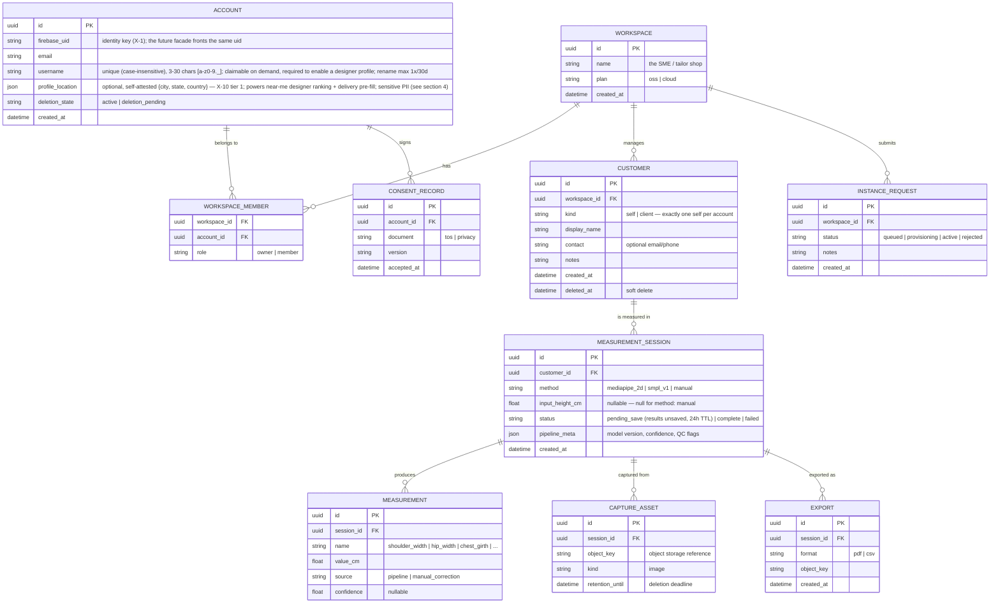
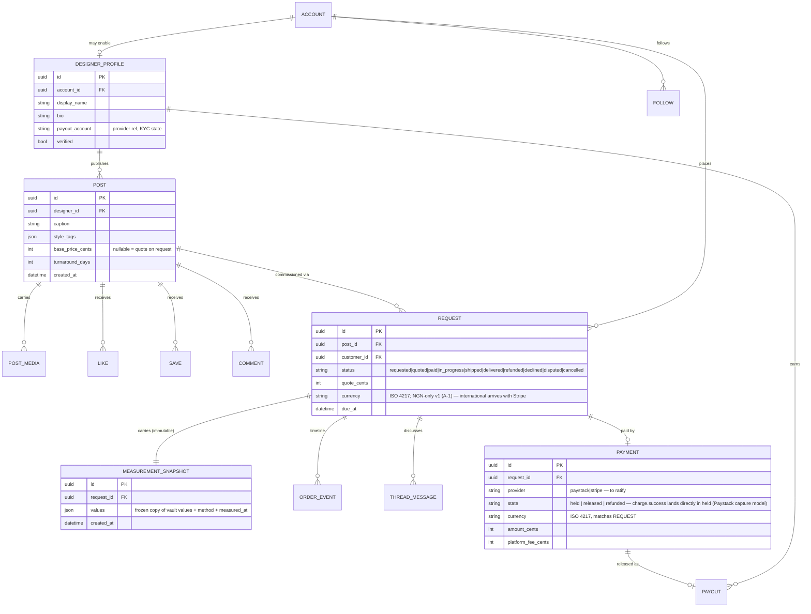
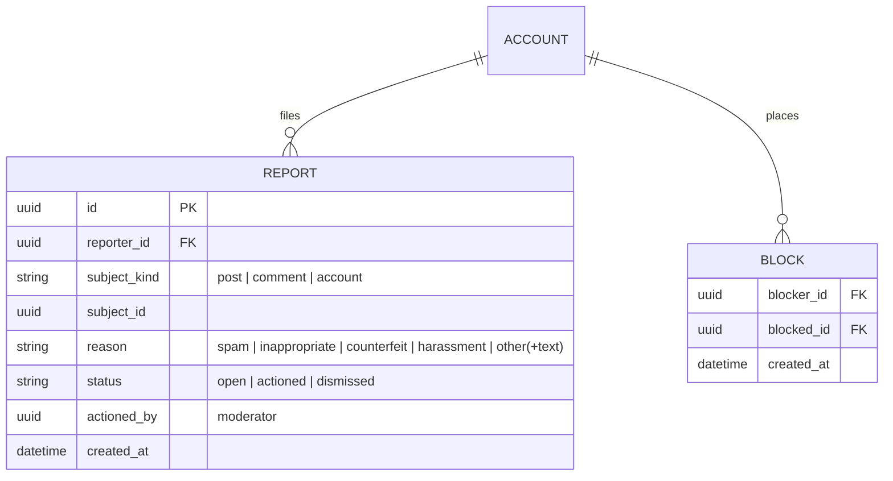

# Apparule — Data Model

> Companion to [prd.md](prd.md) and [architecture.md](architecture.md).
> Markers: **[Current]**, **[PRD]**, **[Proposed]**.

## 1. Current state **[Current]**

There is no server-side domain persistence. The complete inventory of data at
rest today:

| Store | Data | Location |
| --- | --- | --- |
| Phone `SharedPreferences` | `name`, `email`, `phone` (from signup), `isDark` theme flag | Flutter `src/services/persistence.dart` |
| — | Measurement results | **Not stored** — `POST /measure` responses are displayed and discarded |
| Firebase project | Service-account JSON read at boot for auth stubs | Not used as a datastore |

Transient shapes in flight:

- `MeasurementResponse` (api/measure): `body_height_px`, `scale_factor`,
  `shoulder_width_px`, `shoulder_width_cm`, `hip_width_px`, `hip_width_cm`.
- JWT payload (api/common): email subject (currently the service-account email
  — stub), expiry.

## 2. Target entity model **[Proposed]** (satisfies PLAT-001/002, APP-002, §7 compliance)

Modeling notes:

- **Measurement names are an open vocabulary** (a `name` string + registry
  table later, not an enum): the 2-D method produces `shoulder_width`/`hip_width`;
  SMPL adds girths; tailors add manual tape values. Each row carries its
  `source` so pipeline output and human corrections coexist per session
  (sequence 4.3 in architecture.md).
- **Sessions are immutable captures; corrections append** — an audit-friendly
  history rather than destructive edits, given production garments hang off
  these numbers.
- **`input_height_cm` is nullable — null for `method: manual`** **[Decided
  2026-07-22, parity adjudication]**: height is a capture-pipeline input
  (the capture-qc.md §3 scale correction), not a property of a manual tape
  session — clients never invent a height to satisfy the field (the web
  manual-entry sheet's fabricated 168 default ends with this ruling; the
  mobile/canvas position is the model).
- **`CONSENT_RECORD` is deliberately account-scoped, not workspace-scoped** —
  the PRD's ToS gate (§7) binds the person accepting.
- **`CAPTURE_ASSET.retention_until`** operationalizes the retention disclosure:
  source images are the most sensitive artifact and get the shortest default
  retention (e.g. 30 days **[Proposed]**), while derived measurements persist.
- **`ACCOUNT.profile_location` is self-attested tier-1 profile data (X-10)** —
  optional `{city, state, country}`, edited in settings (pages.md B7). It
  powers proximity-ranked designer recommendations ("near me", pages.md B2)
  and pre-fills the request stepper's delivery address (the delivery address
  itself stays frozen per order, §6.3). Designers must set it to be eligible
  for proximity ranking; without it they simply don't rank in "near me"
  results — no hard gate. Classification: sensitive PII (§4), never logged.

## 3. Storage mapping **[Proposed]**

| Concern | Choice | Rationale |
| --- | --- | --- |
| System of record | **Firestore** (default DB, `sandbox-e306a`) — **[Decided X-5]**, revising the earlier Postgres proposal | Firebase-native stack; real-time listeners for feed/threads/notifications; the relational entities in §2 map to collections with the workspace/customer/session hierarchy as document paths. Payments-ledger Postgres escape hatch per X-5. |
| Capture images + exports | Object storage (Firebase Storage today, S3-compatible acceptable) | Large binaries out of the DB; signed URLs for downloads. |
| Cache/queues (later) | Valkey/Redis (declared stack) | Instance-request queue, export jobs — not needed for P0. |

## 4. Data classification & handling **[PRD §7]**

| Class | Data | Rules |
| --- | --- | --- |
| High-sensitivity | Capture images, measurements, customer identity | Encrypted at rest; never logged (no image bytes, no measurement values in logs); shortest retention for images; deletion honours `retention_until`; export/delete rights surfaced in dashboard. |
| Sensitive | Account email, consent records, `profile_location` (self-attested city/state/country — X-10 tier 1) | Standard PII handling; consent rows immutable; profile location never in logs or events. |
| Operational | Session status, pipeline metadata, event counters | No special handling; safe for logs/metrics. |

Deletion semantics: deleting a `CUSTOMER` soft-deletes then hard-purges
sessions, measurements, and capture assets on a fixed schedule (columns above);
Upstat events must only ever carry anonymous counters, never measurement data.

---

## 5. Social commerce entities (2026-07-16 expansion) **[Proposed]**

Rules: measurement snapshots are **frozen copies** (vault changes never
mutate an order); vault data is never public — a snapshot exists only inside
a request the customer initiated (privacy story for APP-005); social counters
(likes/saves) are denormalized on POST with periodic reconciliation; payments
follow escrow: `held` at pay, `released` on delivery confirmation (dispute
pauses release); proximity ranking ("near me", pages.md B2) reads the
designer's `ACCOUNT.profile_location` (§2, X-10 tier 1) — designers without
one don't appear in proximity-ranked results (no hard gate).

---

## 6. Completeness additions (2026-07-16 review)

### 6.1 The personal vault mapping (self-customer) **[Decided]**

Every `ACCOUNT` owns exactly one `CUSTOMER` with `kind: self`, auto-created in
its personal workspace on first session. **The vault IS the self-customer's
sessions** — `/api/v1/me/sessions` routes alias `customers/{self-id}/sessions`.
SME mode manages additional `kind: client` customers; the entity path is
identical, so vault and client-record code share one implementation.

### 6.2 Trust & safety entities (A-6)

**Block semantics** (engineering.md §2): blocked accounts cannot follow,
comment, request, or message the blocker; their posts/comments disappear from
the blocker's feed/explore/search (soft filter, not deletion). **Existing
orders survive a block** — money outranks social — but their threads lock to
order-essential messages only. Blocks are silent (no notification).

### 6.3 Delivery address **[Decided]**

`REQUEST.delivery` embeds `{recipient_name, phone, line1, line2?, city,
state, country}` frozen at submit (like the snapshot — later address-book
edits never mutate an order). Classification: **sensitive PII** — same
handling row as customer identity (§4); never in logs or events.

v1 posture **[Proposed]**: **no stored address book** — the request stepper
pre-fills from the account's most recent `REQUEST.delivery` (first order:
city/state/country seed from `ACCOUNT.profile_location`, §2); a saved
`ADDRESS` entity is tier-1 (X-10) later scope.

### 6.4 Notifications

`NOTIFICATION { id, account_id, kind, payload_ref (order/post id), read_at,
created_at }` — retention 90 days; unread badge counts derive from
`read_at IS NULL`; push delivery via FCM is fire-and-forget (the in-app row
is the source of truth).

### 6.5 Attribute completions

- `POST_MEDIA { id, post_id, object_key, position 0-9, alt_text (required at
  publish; default "Outfit by {designer}" per design.md §5), width, height }`
- `COMMENT { id, post_id, author_id, body ≤ 500 chars, created_at,
  hidden_by_moderation bool }`
- `LIKE / SAVE { post_id, account_id, created_at }` (composite PK)
- `FOLLOW { follower_id, designer_id, created_at }` (composite PK)
- `ORDER_EVENT { id, request_id, kind (state transitions + reminders), actor
  (customer|designer|system|moderator), created_at }`
- `THREAD_MESSAGE { id, request_id, author_id, body ≤ 1000 chars,
  image_object_key?, created_at }`
- `PAYOUT { id, designer_id, request_id, amount_cents, currency,
  provider_transfer_ref, state (pending|paid|failed), created_at }`
- `INSTANCE_REQUEST.status` gains terminal states: `queued | provisioning |
  active | rejected | cancelled | deprovisioned`; every transition notifies
  the requester (in-app + email) per APP-002 "acknowledged".

### 6.6 Operational notes

- Firestore reliability: PITR enabled (7-day window) + daily exports to the
  Cloud Storage bucket (`apparule/backups/…`); recovery runbook lands with
  F2-1. Denormalized social counters reconcile **hourly** (job R4, architecture
  §8).
- Draft captures on device use the platform keystore
  (Keychain / Android Keystore via `flutter_secure_storage`).
