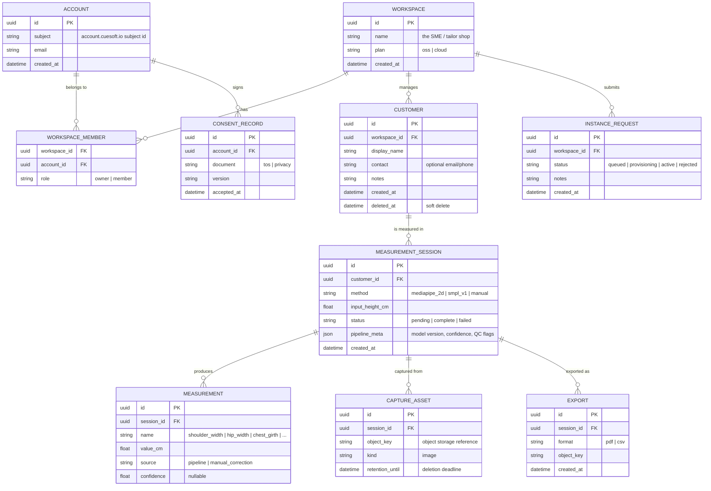
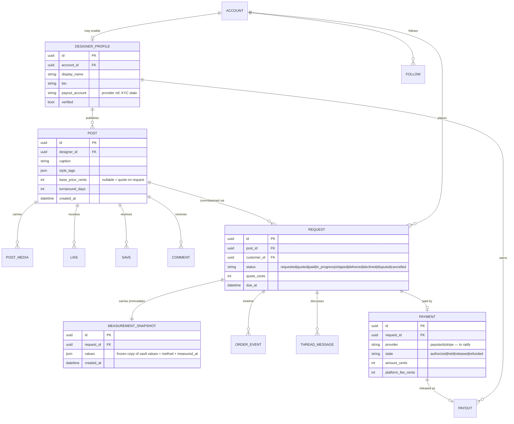

# Apparule — Data Model

> Companion to [prd.md](prd.md) and [architecture.md](architecture.md).
> Markers: **[Current]**, **[PRD]**, **[Proposed]**.

## 1. Current state **[Current]**

There is no server-side domain persistence. The complete inventory of data at
rest today:

| Store | Data | Location |
| --- | --- | --- |
| Phone `SharedPreferences` | `name`, `email`, `phone` (from signup), `isDark` theme flag | Flutter `src/services/persistence.dart` |
| — | Measurement results | **Not stored** — `POST /measure` responses are displayed and discarded |
| Firebase project | Service-account JSON read at boot for auth stubs | Not used as a datastore |

Transient shapes in flight:

- `MeasurementResponse` (api/measure): `body_height_px`, `scale_factor`,
  `shoulder_width_px`, `shoulder_width_cm`, `hip_width_px`, `hip_width_cm`.
- JWT payload (api/common): email subject (currently the service-account email
  — stub), expiry.

## 2. Target entity model **[Proposed]** (satisfies PLAT-001/002, APP-002, §7 compliance)

Modeling notes:

- **Measurement names are an open vocabulary** (a `name` string + registry
  table later, not an enum): the 2-D method produces `shoulder_width`/`hip_width`;
  SMPL adds girths; tailors add manual tape values. Each row carries its
  `source` so pipeline output and human corrections coexist per session
  (sequence 4.3 in architecture.md).
- **Sessions are immutable captures; corrections append** — an audit-friendly
  history rather than destructive edits, given production garments hang off
  these numbers.
- **`CONSENT_RECORD` is deliberately account-scoped, not workspace-scoped** —
  the PRD's ToS gate (§7) binds the person accepting.
- **`CAPTURE_ASSET.retention_until`** operationalizes the retention disclosure:
  source images are the most sensitive artifact and get the shortest default
  retention (e.g. 30 days **[Proposed]**), while derived measurements persist.

## 3. Storage mapping **[Proposed]**

| Concern | Choice | Rationale |
| --- | --- | --- |
| System of record | **Firestore** (default DB, `sandbox-e306a`) — **[Decided X-5]**, revising the earlier Postgres proposal | Firebase-native stack; real-time listeners for feed/threads/notifications; the relational entities in §2 map to collections with the workspace/customer/session hierarchy as document paths. Payments-ledger Postgres escape hatch per X-5. |
| Capture images + exports | Object storage (Firebase Storage today, S3-compatible acceptable) | Large binaries out of the DB; signed URLs for downloads. |
| Cache/queues (later) | Valkey/Redis (declared stack) | Instance-request queue, export jobs — not needed for P0. |
| Firestore | Only if `account.cuesoft.io` integration demands it | Avoid two systems of record. |

## 4. Data classification & handling **[PRD §7]**

| Class | Data | Rules |
| --- | --- | --- |
| High-sensitivity | Capture images, measurements, customer identity | Encrypted at rest; never logged (no image bytes, no measurement values in logs); shortest retention for images; deletion honours `retention_until`; export/delete rights surfaced in dashboard. |
| Sensitive | Account email, consent records | Standard PII handling; consent rows immutable. |
| Operational | Session status, pipeline metadata, event counters | No special handling; safe for logs/metrics. |

Deletion semantics: deleting a `CUSTOMER` soft-deletes then hard-purges
sessions, measurements, and capture assets on a fixed schedule (columns above);
Upstat events must only ever carry anonymous counters, never measurement data.

---

## 5. Social commerce entities (2026-07-16 expansion) **[Proposed]**

Rules: measurement snapshots are **frozen copies** (vault changes never
mutate an order); vault data is never public — a snapshot exists only inside
a request the customer initiated (privacy story for APP-005); social counters
(likes/saves) are denormalized on POST with periodic reconciliation; payments
follow escrow: `held` at pay, `released` on delivery confirmation (dispute
pauses release).
