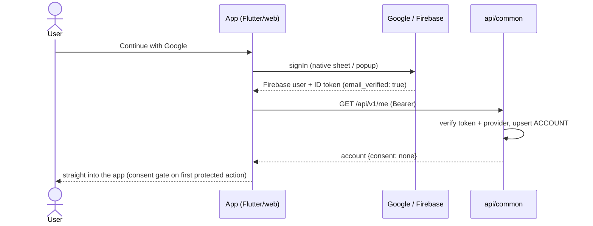

# Flow: Authentication (Google-only, Firebase-backed)

> Implements decision X-1 as hardened 2026-07-16: **Google sign-in is the
> only authentication method** — no username/password signup or login,
> product-wide. Firebase Auth on `sandbox-e306a` underneath; in-app screens.
> Replaces the current stub endpoints (`POST /api/auth/google` and `/email`)
> — the email stub is deleted with no successor.

## 1. Hard rule & enforcement

- **Google provider only.** Enforced at three layers:
  1. Firebase console: Email/Password provider **disabled** on the project;
  2. Backend: token verification rejects any token whose
     `firebase.sign_in_provider ≠ google.com` → `403 provider_not_allowed`;
  3. UI: exactly one auth CTA — "Continue with Google".
- Consequences embraced: no password storage, no reset flow, no credential
  enumeration surface, and `email_verified` is always true (Google-asserted),
  so no separate verification gate exists.

## 2. Session model

- Flutter (`google_sign_in` + `firebase_auth`) / web (Firebase JS SDK popup,
  redirect fallback for in-app browsers) hold the session; SDK auto-refreshes
  ID tokens (~1h).
- API calls send `Authorization: Bearer <Firebase ID token>`; api/common
  verifies (Admin SDK/JWKS, audience `sandbox-e306a`, provider check §1),
  then upserts the `ACCOUNT` row by `firebase_uid` (idempotent).
- `401 token_expired` → silent refresh → retry once → sign-out on repeat.
- Sign-out: SDK signOut + purge local caches; unsaved capture drafts warn.

## 3. Sequence (first sign-in)

## 4. Errors & edge cases

| Case | Behaviour |
| --- | --- |
| Popup/sheet dismissed | silent return, screen unchanged |
| `network-request-failed` *(Firebase SDK constant, not our catalog)* | offline toast + retry |
| `user-disabled` *(Firebase SDK constant)* | "This account has been disabled" + support link |
| Token with wrong provider (crafted email/password token from another tool) | `403 provider_not_allowed`; log server-side |
| Google account without Play Services (Android edge) | `google_sign_in` fallback to web flow |
| In-app browsers blocking popups (IG/Twitter webviews — likely for a social app!) | `signInWithRedirect` fallback; tested explicitly |
| Account deletion | blocked while money is in flight: any non-terminal order (either role) or unsettled payout → `409 account_has_active_orders`; otherwise account enters `deletion_pending` (no new social/commerce actions) and hard-deletes ACCOUNT + vault per retention rules, then the Firebase user, once the last order is terminal and payouts settle; Google access revoked via SDK |

## 5. Screen inventory impact **[flags removals]**

`login_page` becomes the single auth screen (Google CTA + legal links).
`sign_up_form`, `sign_up_screen`, `forgot_password`, `reset_password`,
`verify_email`, `sms_verification`, `verify_account` are **retired** in the
social redesign (pages.md C1 updates accordingly) — phone verification may
return later for designer KYC, which Paystack owns anyway (A-2).

## 6. Instrumentation & acceptance

Events: `auth_signin_completed`, `auth_signin_failed`, `consent_recorded{document}` (emitted by the consent endpoints, F1-5) — counters only, per the master registry.

- [ ] Email/Password provider disabled in Firebase console (verified)
- [ ] Backend rejects non-Google-provider tokens (test with crafted token)
- [ ] Redirect fallback works inside IG/webview browsers on both platforms
- [ ] Stub endpoints deleted; retired screens removed from the router
- [ ] Exactly one ACCOUNT row under concurrent first-login race
