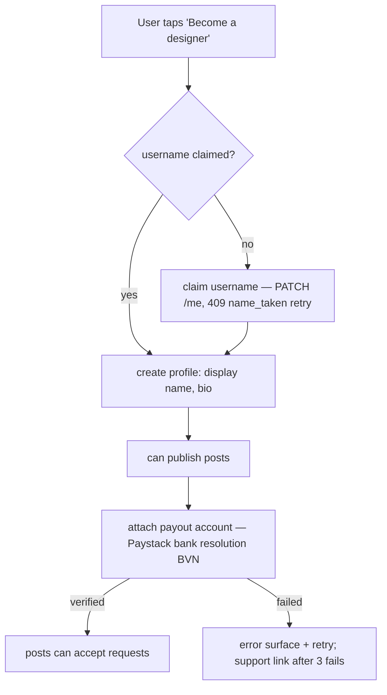

# Flow: Designer Side (onboarding, quoting, fulfilment)

> The designer's half of the commerce loop — request.md is explicitly the
> customer side. State machine + permissions: [order-lifecycle.md](../order-lifecycle.md).
> Preconditions vary per section.

## 1. Becoming a designer (F3-1 / F4-2)

- Posting is allowed pre-KYC; **accepting requests is not** (A-2 gate:
  `post_unavailable` served to customers of non-KYC designers). This lets
  designers build a portfolio before banking details.
- KYC lapse (provider invalidates account): posts stop accepting requests
  (same `post_unavailable`), open orders continue, payouts queue until
  re-verification; designer sees a persistent banner.

## 2. Quoting

| Rule | Value |
| --- | --- |
| Quote window | 7 days from `requested`, expiry cancels (A-7); T-2d reminder to designer |
| Quote contents | `quote_cents` (NGN v1) + `due_at` (≥ today + 1) |
| Requote | allowed while `quoted` (replaces quote, resets the customer's view, does NOT reset expiry) |
| Decline | reason required (enum + text); snapshot purged on the 30-day terminal schedule |
| Concurrent requests | no cap on designer side; the pipeline view (§4) is the workload UI |

## 3. Fulfilment obligations (the escrow clock)

From order-lifecycle.md §1, designer-relevant deadlines:

| State | Deadline | Consequence |
| --- | --- | --- |
| `paid`, not started | **T+14d** | system auto-refund + `refunded`; strike recorded |
| past `due_at`, not shipped | due_at, due_at+7 reminders | customer gets one-click refund-dispute at due_at+14 |
| `shipped` | — | auto-confirm pays out at T+14 if customer silent |

Strikes **[Decided]**: 3 auto-refund strikes in 90 days pauses the profile
(posts stop accepting requests) pending support review — protects customers
from serial ghosting without permanent bans.

## 4. Designer workspace (pages.md B3 "As designer" tab)

- Pipeline list grouped by state with deadline chips (quote expiry, due dates,
  auto-refund countdowns — the escrow clock made visible).
- Order detail: snapshot values (this order only), thread, status actions
  (`in_progress`, `shipped` + optional tracking), decline/quote forms.
- Earnings (pages.md B6): balance = released payouts; pending = held escrow on
  own orders; payout history with provider refs; fee line (10%) itemized per
  order.

## 5. Instrumentation & acceptance

Events: `request_quoted`, `request_declined{reason}`, `payout_released` —
**must be added to the master registry (upstat api.md §3.4) before
implementation** (registry-first rule).

- [ ] Non-KYC designer's posts serve `post_unavailable` to request attempts
- [ ] Quote expiry + requote semantics proven by fixture tests
- [ ] Auto-refund at T+14 fires with strike recording; 3-strike pause works
- [ ] Snapshot visible only within the order; purged post-terminal
- [ ] Earnings math ties to the money invariant (engineering §4)
