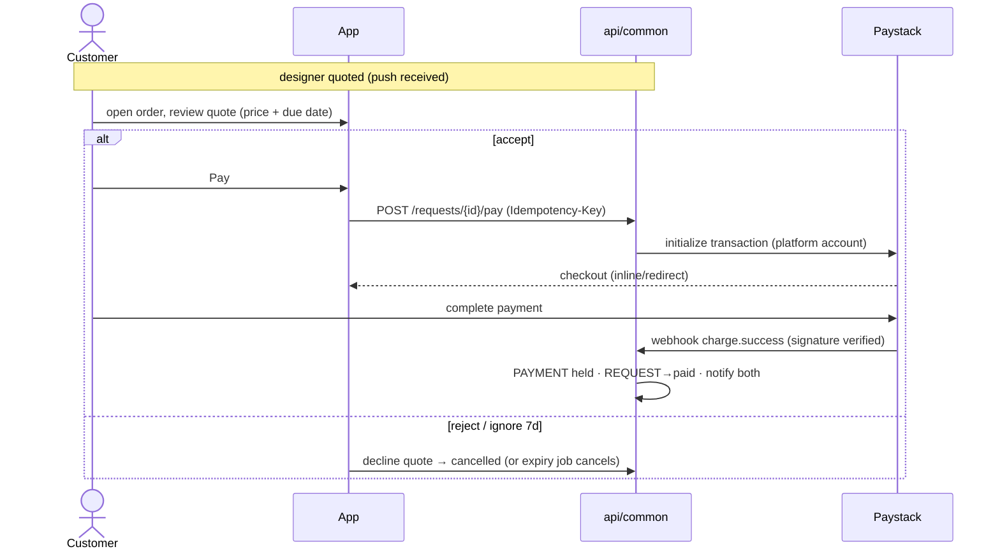

# Flow: Commission Request (customer side)

> UI + contract layer over the state machine in
> [order-lifecycle.md](../order-lifecycle.md). Covers the request stepper
> (pages.md C5/B3, MI-10), payment, and every edge case. Preconditions:
> authed (Google-only ⇒ email always verified, flows/auth.md §1) + non-empty
> vault + consent on file.

## 1. The stepper (3 steps, sheet/modal)

| Step | Content | Validation | Errors |
| --- | --- | --- | --- |
| 1 · Measurements | vault snapshot picker: latest session preselected; freshness warning if >90d ("Measurements are 4 months old — retake?") — warning, not block; shows exactly which values will be shared | ≥1 measurement in selection; session must be `complete` | vault empty → redirect to vault flow with return-path |
| 2 · Details | notes (0–500 chars), budget (optional, ≥ post base price if designer set one — soft warning below), delivery address (recipient, phone, line1/2, city, state — frozen into `REQUEST.delivery` at submit, data-model §6.3), target date (≥ designer turnaround, soft warning) | notes length; date ≥ today+turnaround → else "Designer's typical turnaround is 14 days" warning | |
| 3 · Review | outfit summary, snapshot values (expandable), notes, budget; legal line: accuracy disclaimer + "measurements shared only with this designer for this order" | — | post deleted/designer deactivated since step 1 → `409 post_unavailable` → "This outfit is no longer available" + close |

Submit: `POST /api/v1/posts/{id}/requests` with `Idempotency-Key` (UUID per
stepper session) — double-taps and retries create exactly one request.
Success: MI-10 confetti + "View order". Failure taxonomy:

| Code | Cause | UX |
| --- | --- | --- |
| `409 duplicate_request` | open request already exists for this customer+post | jump to existing order |
| `409 post_unavailable` | deleted/paused/designer KYC-lapsed | copy above |
| `422 snapshot_invalid` | session deleted between steps | back to step 1, picker refreshed |
| `429` | >10 open requests **[Decided default cap]** | "You have too many open requests" |

## 2. Snapshot semantics (privacy-critical)

- Snapshot is a **server-side frozen copy** created at submit — the client
  sends a session id, never raw values.
- Designer sees values only from `requested` on, only for this order
  (order-lifecycle.md §2 matrix).
- Withdrawing (`cancelled`) or `declined` requests: snapshot hard-deleted
  after 30 days terminal-state retention.

## 3. Quote & payment (customer side)

Edge cases:

| Case | Behaviour |
| --- | --- |
| Payment window races quote expiry | expiry job skips orders with a pending payment intent (grace 1h) |
| Webhook lost | reconciliation poll on order open + hourly sweep verifies pending intents against Paystack |
| Double webhook | idempotent by provider reference — second is a no-op |
| Charge succeeds, webhook signature invalid | log + alert ops; order stays `quoted`; reconciliation sweep resolves; NEVER trust unverified webhooks |
| Partial/failed payment | Paystack handles retry UX; order remains `quoted` |
| Customer pays after designer deactivated mid-window | charge refunded automatically, order → `cancelled`, apology copy |

## 4. Delivery confirmation & dispute (customer side)

- `shipped` push → order shows "Confirm delivery" + "Something wrong?".
- Confirm: type nothing, single tap + confirm dialog → `delivered`, payout
  releases, review prompt **[Later]**.
- Auto-confirm T+14d after `shipped`, reminders at T+7 and T+12 (order-lifecycle.md §1/§4 — the single schedule of record).
- Dispute: reason picker (not received / not as described / size wrong /
  other + text) → freezes payout, opens support thread; size-wrong disputes
  attach the snapshot for arbitration (the immutability pays off here).

## 5. Instrumentation

`request_started`, `request_submitted`, `request_paid`, `request_disputed{reason}`,
`request_delivered` — counters; amounts never in events.

## 6. Acceptance checklist

- [ ] Stepper survives: post deletion mid-flow, vault edits mid-flow, app kill (draft restored)
- [ ] Exactly-one request under retry; exactly-one charge under double-tap
- [ ] Webhook signature verification + reconciliation sweep proven by test
- [ ] Snapshot invisible to designer pre-request, purged post-terminal
- [ ] Auto-confirm + reminders fire on schedule; disputes freeze payout
