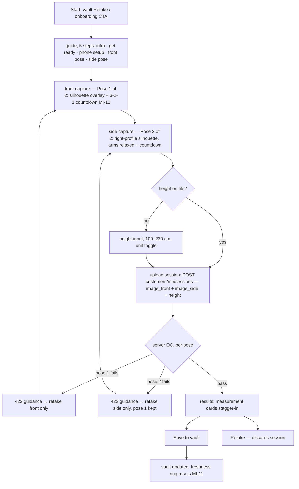

# Flow: Measurement Vault (capture, manual entry, history)

> The vault is the profile's data spine (pages.md B4/C6/C7; data-model.md §2).
> Covers camera capture, manual entry, history, retention — with every edge
> case an implementer needs. Requires auth (flows/auth.md) + verified email
> is NOT required (measuring yourself is private); consent (`tos`,`privacy`)
> IS required before the first session persists.

## 1. Capture flow (camera → pipeline → save)

A capture is **two photos — front, then side (right profile) — plus
height** (M-10, decisions.md). The pose progress renders as a centered
over-media bar title ("Pose 1 of 2" / "Pose 2 of 2"); a QC retry re-enters
the failing pose only and never advances the pose counter.

### Step contracts

| Step | Contract |
| --- | --- |
| Height input | 100–230 cm (39–91 in); stored per account, editable in vault; changing height NEVER retro-scales old sessions (they froze their `input_height_cm`) |
| Upload | multipart `image_front` + `image_side`, each ≤ 10 MB, JPEG/PNG/HEIC; client compresses each to ≤2048px long edge before upload; both images ride one request with one `Idempotency-Key` header (UUID per capture attempt) — retries on flaky mobile MUST NOT create duplicate sessions |
| QC failures | always `422 {error:{code, message, guidance, pose}}` — QC is **per pose** (capture-qc.md §2): the error names the failing pose, first-failure-only within it; the client re-enters that pose's camera only (an accepted pose is never discarded; a retry never advances the pose counter). Full code set from capture-qc.md §1–2 with retake copy: `no_body` "Make sure your whole body is visible" · `multiple_bodies` "Make sure you're alone in frame" · `partial_body` "Include head to ankles" · `undecodable_image` "That image couldn't be read — try another photo" · `low_resolution` "Move closer or use a higher-quality camera" · `poor_lighting` "Find better lighting — avoid strong backlight" · `blurry` "Hold steady and retake" · `not_frontal` "Face the camera straight on" · `camera_tilt` "Hold the phone upright" · `arms_position` (front) "Keep arms slightly away from your body" / (side) "Let your arms hang relaxed at your sides" · `too_far` "Move closer — fill more of the frame" · `not_side_profile` "Turn your right side to the camera" |
| Unsaved results | server session rows created with `status: pending_save`; auto-purged after 24h unsaved **[Decided default]**; "Retake" purges immediately |
| Save | flips `status: complete`; both capture images begin their 30-day `retention_until` clock; measurements persist indefinitely |

### Edge cases

| Case | Behaviour |
| --- | --- |
| Network dies mid-upload | client retries ×3 w/ backoff (same idempotency key); then "Saved to drafts — retry from vault" (draft = local images + height, encrypted via the platform keystore — Keychain / Android Keystore through `flutter_secure_storage`) |
| App killed between poses | the front image persists in the local draft; re-entry resumes at Pose 2 (an accepted pose is never re-shot) |
| App killed after capture, before save | draft persists locally; vault shows "1 unsaved capture" chip on next open |
| Pipeline timeout (>30s) | `503 pipeline_busy`; client offers retry; session row marked `failed` |
| User with no vault opens request flow | redirected here with "You need measurements first" (flows/request.md §2) |
| Camera permission denied | inline explainer + settings deep-link + "enter manually instead" |
| Consent not yet recorded | consent sheet interposes before first upload; declining aborts save (capture stays local draft) |

## 2. Manual entry & corrections

- Manual entry (MI-13): any measurement from the open vocabulary
  (`shoulder_width`, `hip_width`, `chest_girth`, …) as `method: manual`
  sessions; values validated 10–200 cm per measure with the advisory
  ranges below — out-of-range prompts a "double-check" confirm, not a
  hard block (bodies vary). Manual sessions carry **no height** —
  `input_height_cm` is null for `method: manual` (data-model.md §2;
  height is a capture-pipeline input, not a property of tape values).

  | Measure | Advisory range (cm) |
  | --- | --- |
  | `shoulder_width` | 25–75 |
  | `hip_width` | 20–70 |
  | `chest_girth` | 50–160 |
  | `waist_girth` | 40–150 |

  The table is canonical for both clients **[Decided 2026-07-22 —
  parity adjudication: the clients diverged at `waist_girth` (web 160
  vs mobile/canvas 150); settled at the mobile/canvas value 150]**; the
  open vocabulary grows server-side, one advisory row per new measure.
- Corrections on pipeline sessions append `source: manual_correction` rows;
  original pipeline values are never mutated (audit trail, data-model.md §2).
- Unit display cm/in is a view preference; storage is always cm.

## 3. History & retention

- Vault shows latest value per measurement + sparkline; history sheet lists
  sessions (date, method chip, values); deleting a session soft-deletes then
  hard-purges w/ its capture asset; deleting the *latest* session promotes
  the previous one to "current".
- Freshness ring (MI-11): <30d gradient · 30–90d amber · >90d gray; ring
  state computed from latest `complete` session.
- Retention job: capture assets past `retention_until` hard-deleted daily;
  measurements remain. Export/delete-all rights per data-model.md §4.

## 4. Instrumentation

`vault_capture_started`, `vault_qc_failed{code, pose}`,
`vault_session_saved{method}`, `vault_manual_entry` — counters only, never
values.

## 5. Acceptance checklist

- [ ] Full two-pose capture→save on Flutter + webcam path on dashboard
- [ ] Each QC code produces its specific guidance copy; a pose-2 failure
      re-enters the side capture with pose 1 kept
- [ ] Duplicate-session impossible under retry storms (idempotency verified)
- [ ] Unsaved sessions purge at 24h; drafts survive app kill
- [ ] Corrections append, never overwrite; unit toggle pure-view
- [ ] Height change does not alter historical sessions
