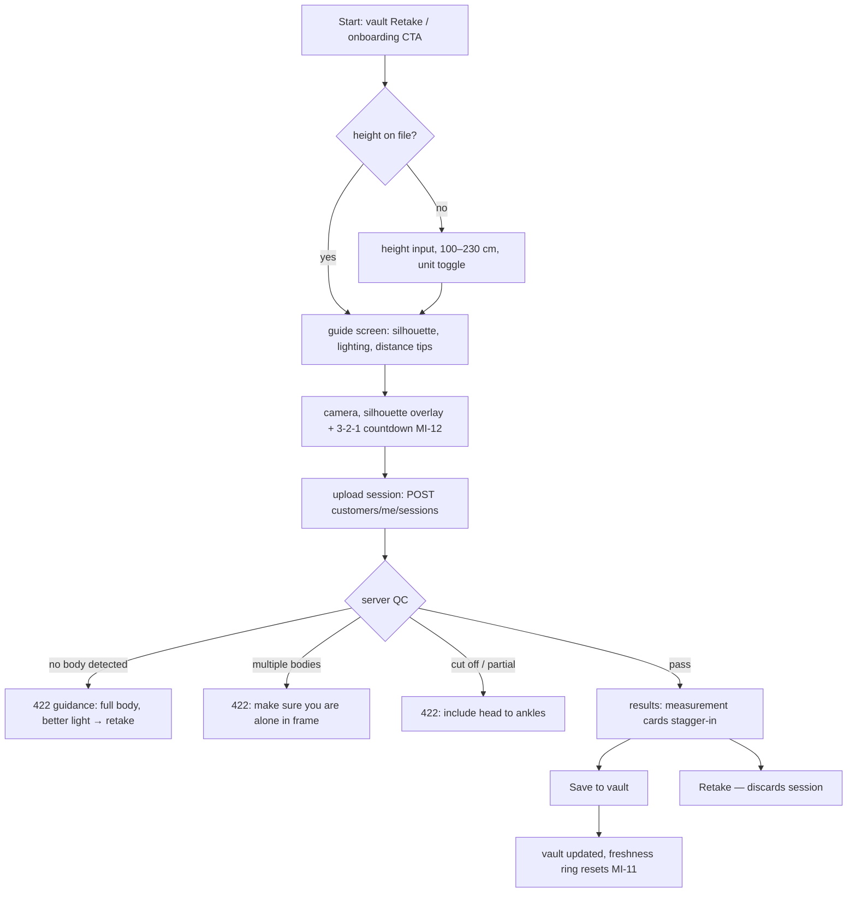

# Flow: Measurement Vault (capture, manual entry, history)

> The vault is the profile's data spine (pages.md B4/C6/C7; data-model.md §2).
> Covers camera capture, manual entry, history, retention — with every edge
> case an implementer needs. Requires auth (flows/auth.md) + verified email
> is NOT required (measuring yourself is private); consent (`tos`,`privacy`)
> IS required before the first session persists.

## 1. Capture flow (camera → pipeline → save)

### Step contracts

| Step | Contract |
| --- | --- |
| Height input | 100–230 cm (39–91 in); stored per account, editable in vault; changing height NEVER retro-scales old sessions (they froze their `input_height_cm`) |
| Upload | multipart image ≤ 10 MB, JPEG/PNG/HEIC; client compresses to ≤2048px long edge before upload; `Idempotency-Key` header (UUID per capture attempt) — retries on flaky mobile MUST NOT create duplicate sessions |
| QC failures | always `422 {error:{code, message, guidance}}`; full code set from capture-qc.md §1–2 with retake copy: `no_body` "Make sure your whole body is visible" · `multiple_bodies` "Make sure you're alone in frame" · `partial_body` "Include head to ankles" · `undecodable_image` "That image couldn't be read — try another photo" · `low_resolution` "Move closer or use a higher-quality camera" · `poor_lighting` "Find better lighting — avoid strong backlight" · `blurry` "Hold steady and retake" · `not_frontal` "Face the camera straight on" · `camera_tilt` "Hold the phone upright" · `arms_position` "Keep arms slightly away from your body" · `too_far` "Move closer — fill more of the frame" |
| Unsaved results | server session rows created with `status: pending_save`; auto-purged after 24h unsaved **[Decided default]**; "Retake" purges immediately |
| Save | flips `status: complete`; capture image begins its 30-day `retention_until` clock; measurements persist indefinitely |

### Edge cases

| Case | Behaviour |
| --- | --- |
| Network dies mid-upload | client retries ×3 w/ backoff (same idempotency key); then "Saved to drafts — retry from vault" (draft = local image + height, encrypted via the platform keystore — Keychain / Android Keystore through `flutter_secure_storage`) |
| App killed after capture, before save | draft persists locally; vault shows "1 unsaved capture" chip on next open |
| Pipeline timeout (>30s) | `503 pipeline_busy`; client offers retry; session row marked `failed` |
| User with no vault opens request flow | redirected here with "You need measurements first" (flows/request.md §2) |
| Camera permission denied | inline explainer + settings deep-link + "enter manually instead" |
| Consent not yet recorded | consent sheet interposes before first upload; declining aborts save (capture stays local draft) |

## 2. Manual entry & corrections

- Manual entry (MI-13): any measurement from the open vocabulary
  (`shoulder_width`, `hip_width`, `chest_girth`, …) as `method: manual`
  sessions; values validated 10–200 cm per measure with per-measure sanity
  ranges (server-side table, e.g. shoulder 25–75 cm) — out-of-range prompts
  "double-check" confirm, not a hard block (bodies vary).
- Corrections on pipeline sessions append `source: manual_correction` rows;
  original pipeline values are never mutated (audit trail, data-model.md §2).
- Unit display cm/in is a view preference; storage is always cm.

## 3. History & retention

- Vault shows latest value per measurement + sparkline; history sheet lists
  sessions (date, method chip, values); deleting a session soft-deletes then
  hard-purges w/ its capture asset; deleting the *latest* session promotes
  the previous one to "current".
- Freshness ring (MI-11): <30d gradient · 30–90d amber · >90d gray; ring
  state computed from latest `complete` session.
- Retention job: capture assets past `retention_until` hard-deleted daily;
  measurements remain. Export/delete-all rights per data-model.md §4.

## 4. Instrumentation

`vault_capture_started`, `vault_qc_failed{code}`, `vault_session_saved{method}`,
`vault_manual_entry` — counters only, never values.

## 5. Acceptance checklist

- [ ] Full capture→save on Flutter + webcam path on dashboard
- [ ] Each QC code produces its specific guidance copy
- [ ] Duplicate-session impossible under retry storms (idempotency verified)
- [ ] Unsaved sessions purge at 24h; drafts survive app kill
- [ ] Corrections append, never overwrite; unit toggle pure-view
- [ ] Height change does not alter historical sessions
