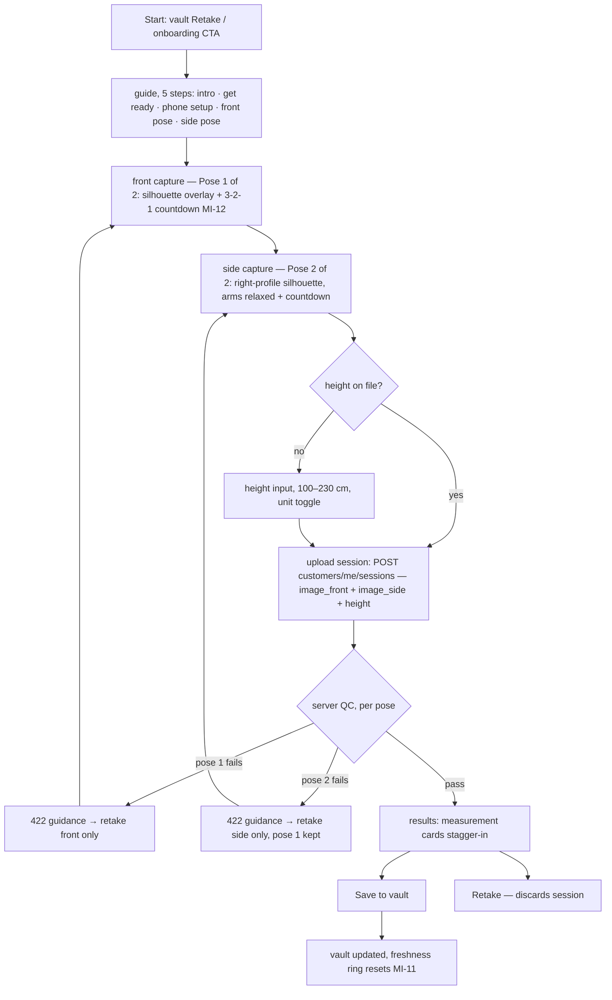

# Flow: Measurement Vault (capture, manual entry, history)

> The vault is the profile's data spine (pages.md B4/C6/C7; data-model.md §2).
> Covers camera capture, manual entry, history, retention — with every edge
> case an implementer needs. Requires auth (flows/auth.md) + verified email
> is NOT required (measuring yourself is private); consent (`tos`,`privacy`)
> IS required before the first session persists.

## 1. Capture flow (camera → pipeline → save)

A capture is **two photos — front, then side (right profile) — plus
height** (M-10, decisions.md). **Platform split (M-12)**: mobile runs the
guided two-pose camera below; web is **upload-only** — a two-file upload
(front + side) into the same `POST` and per-pose QC pipeline, with a
"best experience: guided capture on the mobile app" hint (no webcam flow
— full-body webcam capture is rejected UX: desk-height lens, unreachable
controls). On mobile the pose progress renders as a centered over-media
bar title ("Pose 1 of 2" / "Pose 2 of 2"); a QC retry re-enters the
failing pose only and never advances the pose counter (web: re-pick the
failing pose's file).

```mermaid
flowchart TD
    S[Start: vault Retake / onboarding CTA] --> GUIDE[guide, 5 steps: intro · get ready · phone setup · front pose · side pose]
    GUIDE --> CAM1[front capture — Pose 1 of 2: silhouette overlay + 3-2-1 countdown MI-12]
    CAM1 --> CAM2[side capture — Pose 2 of 2: right-profile silhouette, arms relaxed + countdown]
    CAM2 --> H{height on file?}
    H -->|no| HEIGHT[height input, 100–230 cm, unit toggle]
    H -->|yes| UP
    HEIGHT --> UP[upload session: POST customers/me/sessions — image_front + image_side + height]
    UP --> QC{server QC, per pose}
    QC -->|pose 1 fails| R1[422 guidance → retake front only]
    QC -->|pose 2 fails| R2[422 guidance → retake side only, pose 1 kept]
    QC -->|pass| RESULTS[results: measurement cards stagger-in]
    R1 --> CAM1
    R2 --> CAM2
    RESULTS --> SAVE[Save to vault]
    RESULTS --> RETAKE[Retake — discards session]
    SAVE --> DONE[vault updated, freshness ring resets MI-11]
```

### Step contracts

| Step | Contract |
| --- | --- |
| Height input | 100–230 cm (39–91 in); stored per account, editable in vault; changing height NEVER retro-scales old sessions (they froze their `input_height_cm`) |
| Upload | multipart `image_front` + `image_side`, each ≤ 10 MB, JPEG/PNG/HEIC; client compresses each to ≤2048px long edge before upload; both images ride one request with one `Idempotency-Key` header (UUID per capture attempt) — retries on flaky mobile MUST NOT create duplicate sessions |
| QC failures | always `422 {error:{code, message, guidance, pose}}` — QC is **per pose** (capture-qc.md §2): the error names the failing pose, first-failure-only within it; the client re-enters that pose's camera (mobile) / re-picks that pose's file (web, M-12) — an accepted pose is never discarded; a retry never advances the pose counter. Full code set from capture-qc.md §1–2 with retake copy: `no_body` "Make sure your whole body is visible" · `multiple_bodies` "Make sure you're alone in frame" · `partial_body` "Include head to ankles" · `undecodable_image` "That image couldn't be read — try another photo" · `low_resolution` "Move closer or use a higher-quality camera" · `poor_lighting` "Find better lighting — avoid strong backlight" · `blurry` "Hold steady and retake" · `not_frontal` "Face the camera straight on" · `camera_tilt` "Hold the phone upright" · `arms_position` (front) "Keep arms slightly away from your body" / (side) "Let your arms hang relaxed at your sides" · `too_far` "Move closer — fill more of the frame" · `not_side_profile` "Turn your right side to the camera" |
| Unsaved results | server session rows created with `status: pending_save`; auto-purged after 24h unsaved **[Decided default]**; "Retake" purges immediately |
| Save | flips `status: complete`; both capture images begin their 30-day `retention_until` clock; measurements persist indefinitely |

### Edge cases

| Case | Behaviour |
| --- | --- |
| Network dies mid-upload | client retries ×3 w/ backoff (same idempotency key); then "Saved to drafts — retry from vault" (draft = local images + height, encrypted via the platform keystore — Keychain / Android Keystore through `flutter_secure_storage`) |
| App killed between poses | the front image persists in the local draft; re-entry resumes at Pose 2 (an accepted pose is never re-shot) |
| App killed after capture, before save | draft persists locally; vault shows "1 unsaved capture" chip on next open |
| Pipeline timeout (>30s) | `503 pipeline_busy`; client offers retry; session row marked `failed` |
| User with no vault opens request flow | redirected here with "You need measurements first" (flows/request.md §2) |
| Camera permission denied | inline explainer + settings deep-link + "enter manually instead" |
| Consent not yet recorded | consent sheet interposes before first upload; declining aborts save (capture stays local draft) |

## 2. Manual entry & corrections

- Manual entry (MI-13): tape values as `method: manual` sessions using the
  tailor-sourced A-10 templates below — the customer's
  `measurement_template` (`women | men`, data-model.md §2) selects the
  field set; when it is null the sheet interposes a one-time Women/Men
  chooser and persists the answer (editable later in profile settings).
  Values validated 10–200 cm per measure with the advisory ranges below —
  out-of-range prompts a "double-check" confirm, not a hard block (bodies
  vary). Manual sessions carry **no height** — `input_height_cm` is null
  for `method: manual` (data-model.md §2; height is a capture-pipeline
  input, not a property of tape values).

  **Women** (17):

  | Measure | Advisory range (cm) |
  | --- | --- |
  | `shoulder` | 30–60 |
  | `bust` | 60–160 |
  | `under_bust` | 55–140 |
  | `bust_span` | 12–30 |
  | `waist` | 50–150 |
  | `shoulder_to_bust_point` | 18–40 |
  | `shoulder_to_under_bust` | 25–50 |
  | `shoulder_to_waist` | 30–60 |
  | `half_length` | 30–70 |
  | `waist_to_knee` | 40–75 |
  | `gown_length` | 90–170 |
  | `skirt_length` | 40–120 |
  | `trouser_length` | 80–120 |
  | `thigh` | 40–90 |
  | `knee` | 25–60 |
  | `sleeve_length` | 15–70 |
  | `sleeve_width` | 20–50 |

  **Men** (14):

  | Measure | Advisory range (cm) |
  | --- | --- |
  | `shoulder` | 30–60 |
  | `chest` | 70–160 |
  | `waist` | 50–150 |
  | `top_length` | 55–100 |
  | `thigh` | 40–90 |
  | `hip` | 70–160 |
  | `knee` | 25–60 |
  | `shin` | 20–50 |
  | `waist_to_knee` | 40–75 |
  | `trouser_length` | 80–120 |
  | `trouser_inseam` | 60–95 |
  | `biceps` | 20–50 |
  | `sleeve_length` | 15–70 |
  | `neck` | 25–55 |

  Both tables are canonical for web, mobile, and canvas **[Decided
  2026-07-25 — A-10: field list collected from a practicing Nigerian
  tailor]**. The 7 measures shared by both templates carry identical
  ranges. Labels render by humanizing the snake_case name
  (`shoulder_to_bust_point` → "Shoulder to bust point"); ranges display
  in the user's unit (inches by default, A-9). Legacy manual names
  (`chest_girth`, `waist_girth`) and the camera-pipeline names
  (`shoulder_width`, `hip_width`) remain valid vocabulary on historical
  sessions — sessions are immutable; the sheet simply no longer offers
  the legacy manual rows. The registry grows server-side, one advisory
  row per new measure.
- Corrections on pipeline sessions append `source: manual_correction` rows;
  original pipeline values are never mutated (audit trail, data-model.md §2).
- Unit display cm/in is a view preference; storage is always cm.

## 3. History & retention

- Vault shows latest value per measurement + sparkline; history sheet lists
  sessions (date, method chip, values); deleting a session soft-deletes then
  hard-purges w/ its capture asset; deleting the *latest* session promotes
  the previous one to "current".
- Freshness ring (MI-11): <30d gradient · 30–90d amber · >90d gray; ring
  state computed from latest `complete` session.
- Retention job: capture assets past `retention_until` hard-deleted daily;
  measurements remain. Export/delete-all rights per data-model.md §4.

## 4. Instrumentation

`vault_capture_started`, `vault_qc_failed{code, pose}`,
`vault_session_saved{method}`, `vault_manual_entry` — counters only, never
values.

## 5. Acceptance checklist

- [ ] Full two-pose capture→save on Flutter + the two-file upload path on
      dashboard (upload-only, M-12)
- [ ] Each QC code produces its specific guidance copy; a pose-2 failure
      re-enters the side capture with pose 1 kept
- [ ] Duplicate-session impossible under retry storms (idempotency verified)
- [ ] Unsaved sessions purge at 24h; drafts survive app kill
- [ ] Corrections append, never overwrite; unit toggle pure-view
- [ ] Height change does not alter historical sessions
