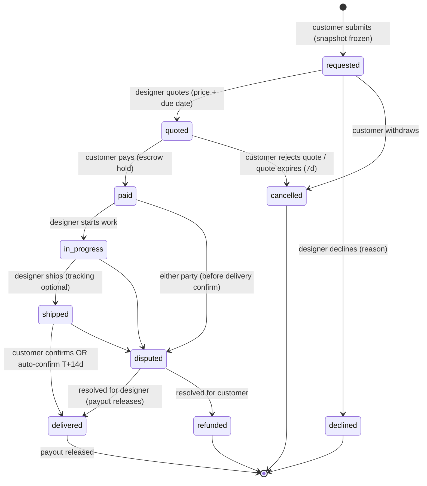

# Apparule — Commission Order Lifecycle

> The full state machine behind SOC-004/005/006 (pages.md B3/C5/C8,
> data-model.md §5 `REQUEST`). **[Proposed]** — this is the contract the
> commerce phase implements; payments/escrow specifics gated on the provider
> decision.

## 1. State machine

Rules:

- **Measurement snapshot freezes at `requested`** — later vault changes never
  mutate an order; a re-measure prompts a *new* request.
- **Quotes expire** after 7 days un-actioned (state → `cancelled`, both
  parties notified) **[default to ratify]**.
- **Auto-confirm**: `shipped` → `delivered` at T+14 days without customer
  action, after two reminders — protects designer payout from ghosting
  **[default to ratify]**.
- **Dispute window** ends at delivery confirmation; disputes freeze payout
  and open a support thread (routes to `clients.cuesoft.io` when live).
- Cancellation after `paid` is a refund path, not a `cancelled` transition —
  money movements only ever resolve through `delivered` (payout) or
  `refunded`.

## 2. Permissions matrix

| Action | Customer | Designer | System |
| --- | --- | --- | --- |
| submit request | ✓ (with owned snapshot) | — | — |
| quote / decline | — | ✓ | quote expiry |
| pay | ✓ | — | — |
| start / ship | — | ✓ | — |
| confirm delivery | ✓ | — | auto-confirm T+14 |
| open dispute | ✓ | ✓ | — |
| resolve dispute | — | — | support/admin only |
| view snapshot values | ✓ (own) | ✓ (this order only) | — |

The snapshot-visibility rule is the privacy core: a designer sees a
customer's measurements **only inside an order that customer initiated**,
and only that frozen copy.

## 3. Money movement (escrow model, provider-gated)

| Event | Movement |
| --- | --- |
| `paid` | full quote captured to platform escrow; `PAYMENT.state = held` |
| `delivered` | payout = quote − platform fee → designer payout account; `released` |
| `refunded` | escrow returns to customer (fee handling per provider rules) |

Platform fee % and payout timing (instant vs T+2) are provider-dependent —
decide with the provider (Paystack-first for NG rails, Stripe for
international **[Proposed]**). Designer payouts require completed KYC
(`DESIGNER_PROFILE.payout_account` verified) *before* their posts can accept
requests — not at payout time, when it's too late.

## 4. Notifications map (SOC-008)

| Transition | Customer | Designer |
| --- | --- | --- |
| requested | receipt confirmation | **push + badge: new request** |
| quoted | **push: quote received** (+T-2d expiry reminder) | — |
| paid | payment receipt | **push: order funded — start work** |
| in_progress | status update | — |
| shipped | **push: shipped** (+tracking) | — |
| delivered−2d (pending auto-confirm) | reminder ×2 | — |
| delivered | confirmation + review prompt **[Later]** | **push: payout released** |
| declined / cancelled / disputed / refunded | push | push |

All notifications also land in the in-app activity sheet (pages.md C10);
email mirrors only money events (paid, payout, refund) **[Proposed]**.

## 5. Thread messaging scope

Each request carries one message thread (SOC-005), open from `requested`
until 30 days after terminal state. Attachments: images only (reference
photos, progress shots). No payment links in threads (anti-fee-evasion +
safety); the pay CTA is only ever the order's own payment box. Full DMs
outside orders remain out of scope (SOC-010).
