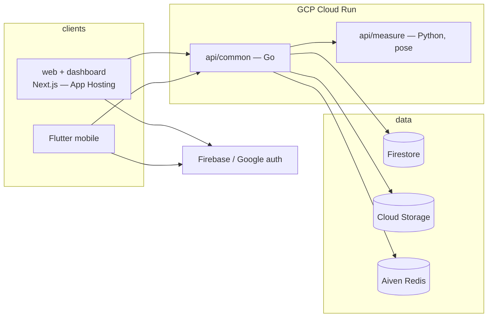

# Overview

Apparule is a fashion body-measurement platform. Users capture their body
measurements from their phone, and the platform turns those into sizing data
for a better-fitting shopping experience.

## Architecture

- **`web`** — Next.js marketing site + user dashboard (Firebase App Hosting).
- **`mobile`** — Flutter app (iOS/Android) for capturing measurements.
- **`api/common`** — Go service: authentication and core API (Cloud Run).
- **`api/measure`** — Python service: MediaPipe pose-based body measurement.
- **Auth** — Firebase Authentication / Google sign-in.
- **Data** — Firestore (system of record, X-5) & Cloud Storage; shared Aiven Redis (REDIS_DB tenancy).

See [setup.md](setup.md) to run the stack locally, and the
[repository structure](https://github.com/cuesoftinc/apparule#repository-structure) in the README.

## Product & design documentation
> Published site: **https://cuesoft.gitbook.io/apparule** (Git-synced from this folder on every merge to main).

- [prd.md](prd.md) — product requirements breakdown (personas, requirements, compliance, open questions)
- [architecture.md](architecture.md) — current vs target system design, sequences, SMPL pipeline
- [data-model.md](data-model.md) — entities, storage mapping, data classification
- [api.md](api.md) — current + target API surface and gap analysis
- [roadmap.md](roadmap.md) — phased plan with cross-repo dependencies
- [design.md](design.md) + [pages.md](pages.md) — design language, screens, microinteractions
- [order-lifecycle.md](order-lifecycle.md) — commission order state machine, permissions, notifications
- [decisions.md](decisions.md) — the open-decision register: ratify to unblock phases
- [deployment.md](deployment.md) — Cloud Run + App Hosting contract (cuesoft-iac provisioning, CI/CD pattern)
- flows/ — feature flow specs with edge cases: [auth](flows/auth.md), [vault](flows/vault.md), [request](flows/request.md)
- [capture-qc.md](capture-qc.md) — QC thresholds + measurement-confidence formulas
- [engineering.md](engineering.md) — error catalog, authz matrix, rate limits, testing strategy, logging rules
- [features.md](features.md) — granular build backlog (stable unit IDs per phase)
